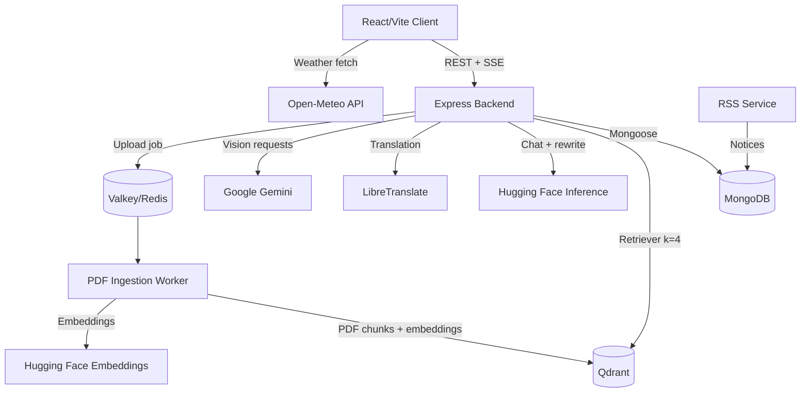
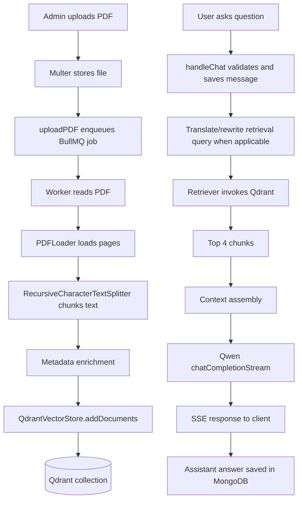
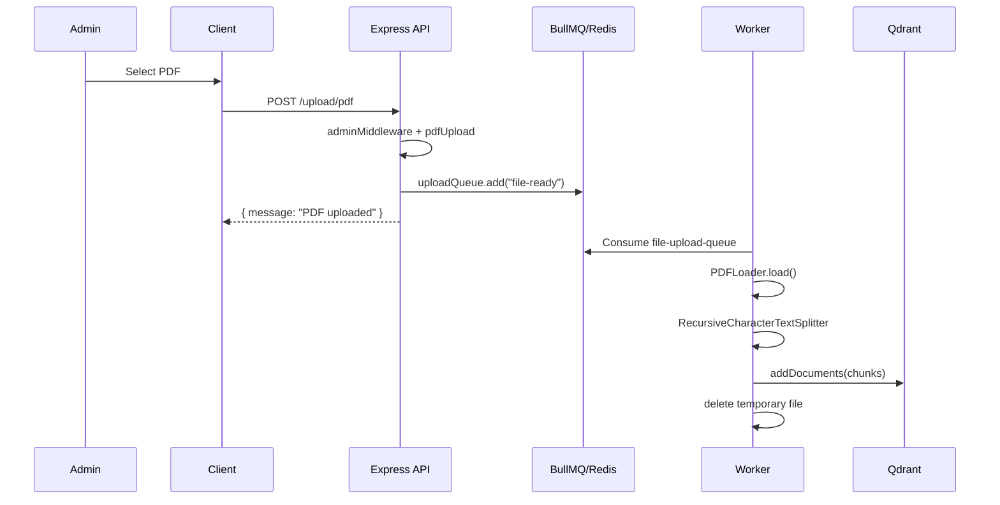
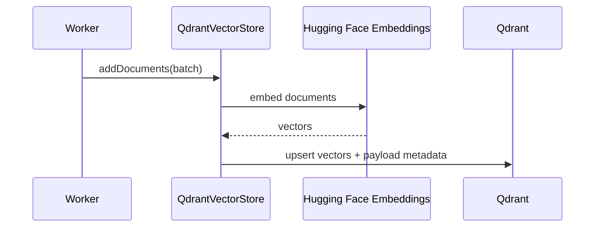
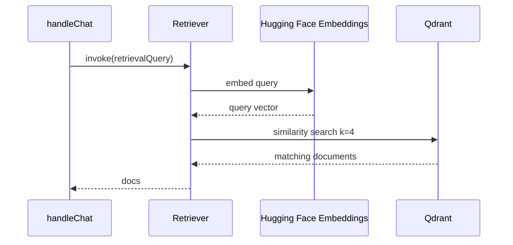
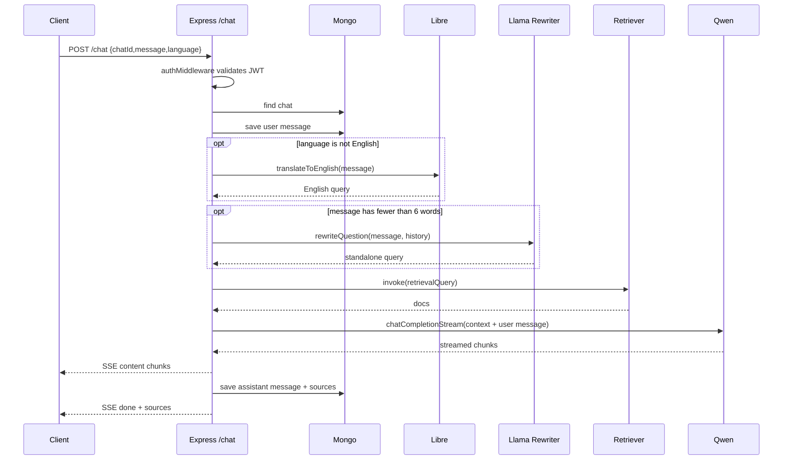

# KisanAI RAG Architecture and Workflow Documentation

Generated from source-code inspection of this repository. Claims below are based on code evidence; missing features are marked "Not Found in Codebase".

## 1. Executive Summary

KisanAI implements a document-grounded agriculture chatbot named Bhoomi. The backend uses Express APIs, MongoDB chat persistence, BullMQ/Redis upload jobs, a PDF ingestion worker, Hugging Face embeddings, Qdrant vector storage, and Hugging Face chat-completion streaming for answer generation.

The RAG path is split into two runtime flows:

- Ingestion flow: admin uploads a PDF, Express stores it with Multer, enqueues a BullMQ job, and `server/worker.js` parses, chunks, embeds, and stores chunks in Qdrant.
- Query flow: authenticated users send chat messages to `POST /chat`; `handleChat()` optionally translates and rewrites the query, invokes the Qdrant retriever, builds context, streams an LLM response, and saves the conversation in MongoDB.

No explicit re-ranking, hybrid keyword/vector search, semantic chunking, metadata filtering, prompt-injection sanitizer, rate limiter, or application cache was found in the codebase.

## 2. Technology Stack

| Layer | Technology | Evidence |
|---|---|---|
| Frontend | React, Vite, React Router, Framer Motion, Lucide, Tailwind | `client/package.json:6-18`, `client/package.json:20-32` |
| Backend API | Node.js, Express | `server/package.json:6-10`, `server/package.json:24-31`, `server/index.js:28-52` |
| Database | MongoDB with Mongoose | `server/config/db.js:13-19`, `server/models/*.js` |
| Vector DB | Qdrant | `server/config/ai.js:7-8`, `server/config/ai.js:25-39`, `docker-compose.yml:8-11` |
| Queue | BullMQ with Redis/Valkey | `server/config/queue.js:1-7`, `server/worker.js:5`, `docker-compose.yml:3-6` |
| Embeddings | Hugging Face `sentence-transformers/all-MiniLM-L6-v2` | `server/config/ai.js:18-21`, `server/worker.js:17-20` |
| Chat LLM | Hugging Face Inference, `Qwen/Qwen2.5-72B-Instruct` | `server/config/ai.js:12`, `server/controllers/chatController.js:178-203` |
| Query rewriting LLM | Hugging Face Inference, `meta-llama/Meta-Llama-3.1-8B-Instruct` | `server/services/aiService.js:31-36` |
| Vision AI | Google Gemini `gemini-2.5-flash` | `server/config/ai.js:14-16`, `server/services/visionService.js:55-73` |
| Translation | LibreTranslate HTTP API | `server/services/translationService.js:13-31`, `server/services/translationService.js:40-76`, `docker-compose.yml:13-17` |
| RSS notices | Node cron, rss-parser, MongoDB | `rss-service/package.json:11-15`, `rss-service/index.js:31-39` |

## 3. Project Structure

- `client/`: React/Vite frontend. Calls backend APIs through `authFetch()` and streams SSE chat responses.
- `server/`: Express backend, auth, chat/RAG routes, upload route, MongoDB models, AI config, queue config, disease-detection service.
- `server/worker.js`: BullMQ worker for PDF ingestion into Qdrant.
- `rss-service/`: independent scheduled service that parses RSS feeds and stores notices in MongoDB.
- `docker-compose.yml`: local orchestration for Valkey, Qdrant, LibreTranslate, backend, worker, client, and RSS service.

## 4. Backend Architecture

`server/index.js` creates an Express app, enables CORS and JSON parsing, connects MongoDB, serves uploaded files, and mounts route modules:

- `/auth` -> `server/routes/auth.js`
- `/admin` -> `server/routes/admin.js`
- `/upload` -> `server/routes/upload.js`
- `/chat` -> `server/routes/chat.js`
- `/api/notices` -> `server/routes/noticeRoutes.js`

Evidence: `server/index.js:28-52`.

The RAG-specific API is `POST /chat`, routed by `server/routes/chat.js:22` to `handleChat()` in `server/controllers/chatController.js:105-235`.

The PDF ingestion API is `POST /upload/pdf`, routed by `server/routes/upload.js:8` through `adminMiddleware`, `pdfUpload.single("pdf")`, and `uploadPDF()`.

## 5. Database Architecture

MongoDB is connected by `connectDB()` using `process.env.MONGODB_URI`.

Evidence: `server/config/db.js:13-19`.

### User Model

File: `server/models/User.js`

Fields:

- `name`: required, trimmed string.
- `email`: required, unique, lowercase, trimmed, indexed string.
- `password`: required string.
- timestamps enabled.

Evidence: `server/models/User.js:3-24`.

### Chat Model

File: `server/models/Chat.js`

Stores normal RAG chat sessions. Fields:

- `userId`: required ObjectId.
- `chatId`: required string.
- `title`: default `"New Chat"`.
- `messages`: array of message subdocuments with `role`, `content`, optional `imageUrl`, optional `imageAnalysis`.
- unique index on `{ userId, chatId }`.

Evidence: `server/models/Chat.js:3-25`.

### DiseaseDetection Model

File: `server/models/DiseaseDetection.js`

Stores image diagnosis sessions separately from normal chat. Fields include `userId`, `chatId`, `title`, and messages with image metadata.

Evidence: `server/models/DiseaseDetection.js:3-26`.

### Notice Model

File: `server/models/Notice.js`

Stores RSS notices with `title`, `summary`, `source_name`, `source_type`, `published_date`, `article_url`, `content_hash`, and `created_at`. It indexes `published_date`.

Evidence: `server/models/Notice.js:3-43`.

## 6. Vector Database Architecture

Qdrant is configured in both backend and worker code using `QdrantClient` and `QdrantVectorStore`.

- URL: `process.env.QDRANT_URL || "http://localhost:6333"`.
- Collection name: `"langchainjs-testing"`.
- Compatibility check disabled.
- Embedding function: Hugging Face `sentence-transformers/all-MiniLM-L6-v2`.

Evidence:

- Backend retriever setup: `server/config/ai.js:18-43`.
- Worker vector store setup: `server/worker.js:17-38`.
- Docker Qdrant service: `docker-compose.yml:8-11`.

Vector metadata is enriched during ingestion:

- original `doc.metadata`
- `filename`
- `userId`
- `source: "pdf"`

Evidence: `server/worker.js:53-61`.

Embedding dimensions are not explicitly configured in code. The selected model is commonly 384-dimensional, but that dimension is Not Found in Codebase as an explicit setting.

## 7. RAG Pipeline Overview

1. Admin uploads PDF through frontend `AdminUpload.uploadPdf()`.
2. Backend `POST /upload/pdf` validates admin JWT and PDF MIME type.
3. `uploadPDF()` enqueues a BullMQ `"file-ready"` job.
4. `server/worker.js` consumes the queue, reads the PDF, loads pages with `PDFLoader`, chunks with `RecursiveCharacterTextSplitter`, enriches metadata, and stores embeddings in Qdrant.
5. User sends a message through `Chatbot.handleSubmit()`.
6. `handleChat()` validates request and loads the MongoDB chat session.
7. It saves the user message, builds recent history, optionally translates non-English text to English, and rewrites short questions.
8. It invokes `retriever.invoke(retrievalQuery)` with `k: 4`.
9. It assembles context from retrieved chunks.
10. It streams a Qwen response through Hugging Face Inference as SSE.
11. It stores the assistant answer and source previews in MongoDB.

## 8. Document Ingestion Workflow

### Upload Endpoint

File: `server/routes/upload.js`

Route: `POST /upload/pdf`

Middleware and handler:

- `adminMiddleware`: validates admin JWT.
- `pdfUpload.single("pdf")`: handles PDF upload.
- `uploadPDF`: enqueues processing job.

Evidence: `server/routes/upload.js:1-10`.

### File Upload Rules

File: `server/utils/multer.js`

- PDF upload directory: `uploads`.
- PDF filename: `${Date.now()}-${file.originalname}`.
- Max PDF file size: 200 MB.
- MIME check: must equal `application/pdf`.

Evidence: `server/utils/multer.js:4-25`.

### Queueing

File: `server/controllers/uploadController.js`

Function: `uploadPDF(req, res)`

Input:

- `req.file.originalname`
- `req.file.path`

Output:

- BullMQ job named `"file-ready"`.
- JSON `{ message: "PDF uploaded" }`.

Evidence: `server/controllers/uploadController.js:8-18`.

File: `server/config/queue.js`

Queue:

- name: `"file-upload-queue"`
- connection host: `REDIS_HOST || "localhost"`
- connection port: `REDIS_PORT || 6379`

Evidence: `server/config/queue.js:1-7`.

### PDF Parsing and Text Extraction

File: `server/worker.js`

Function: BullMQ worker processor at `server/worker.js:40-77`.

Steps:

- Reads job data `{ path, filename, userId }`.
- Validates file path exists.
- Reads file with `fs.readFileSync(path)`.
- Creates `PDFLoader(new Blob([fileBuffer]), { splitPages: true })`.
- Calls `loader.load()`.

Evidence: `server/worker.js:40-49`.

Data cleaning beyond PDF extraction is Not Found in Codebase.

Metadata generation exists only as simple enrichment with `filename`, `userId`, and `source`.

Evidence: `server/worker.js:53-61`.

## 9. Embedding Workflow

Embedding object:

- Class: `HuggingFaceInferenceEmbeddings`
- API key: `process.env.HUGGINGFACE_API_KEY`
- Model: `sentence-transformers/all-MiniLM-L6-v2`

Evidence:

- Backend: `server/config/ai.js:18-21`.
- Worker: `server/worker.js:17-20`.

Generation workflow:

- The code does not directly call an embedding method.
- The worker passes documents to `vectorStore.addDocuments(...)`.
- LangChain's `QdrantVectorStore` uses the configured embeddings internally.

Evidence: `server/worker.js:63-67`.

Batching:

- `batchSize = 50`.
- Documents are added in slices of 50.

Evidence: `server/worker.js:63-67`.

Duplicate embedding prevention is Not Found in Codebase.

## 10. Retrieval Workflow

Retriever setup:

- Source: `vectorStore.asRetriever({ k: 4 })`.
- Collection: `"langchainjs-testing"`.

Evidence: `server/config/ai.js:30-43`.

Retrieval call:

- `const docs = await retriever.invoke(retrievalQuery);`

Evidence: `server/controllers/chatController.js:149`.

Inputs:

- `retrievalQuery`: original message, translated message, or rewritten short question.

Outputs:

- `docs`: LangChain documents with `pageContent` and `metadata`.

Top-K:

- `k: 4`.

Filtering:

- Metadata filtering is Not Found in Codebase.
- User-specific filtering is Not Found in Codebase, even though ingestion metadata includes `userId`.

Hybrid search:

- Not Found in Codebase.

Similarity score threshold:

- Not Found in Codebase.

## 11. Prompt Construction Workflow

Question rewriting prompt:

- File: `server/services/aiService.js`
- Function: `rewriteQuestion(question, history)`
- Purpose: rewrite follow-up questions into standalone agriculture questions.
- Trigger: only when `message.split(" ").length < 6`.

Evidence:

- Prompt body: `server/services/aiService.js:16-29`.
- LLM call: `server/services/aiService.js:31-36`.
- Trigger: `server/controllers/chatController.js:141-147`.

Context assembly:

```js
const context = docs
    .map((d, i) => `Source ${i + 1}:\n${d.pageContent}`)
    .join("\n\n");
```

Evidence: `server/controllers/chatController.js:172-174`.

Answer-generation system prompt:

- Defines persona: Bhoomi, expert agricultural assistant.
- Instructs answer only from context.
- Provides fallback text if context lacks answer.
- Requires simple language, practical advice, and language-specific response.
- Appends full context into system message.

Evidence: `server/controllers/chatController.js:178-203`.

Context compression is Not Found in Codebase.

Prompt-injection filtering is Not Found in Codebase.

## 12. LLM Generation Workflow

File: `server/controllers/chatController.js`

Function: `handleChat()`

LLM call:

- `hfClient.chatCompletionStream(...)`
- Model: `Qwen/Qwen2.5-72B-Instruct`
- Temperature: `0.3`
- Max tokens: `500`

Evidence: `server/controllers/chatController.js:178-203`.

Streaming:

- Iterates over async chunks.
- Reads `chunk.choices[0]?.delta?.content`.
- Appends to `fullAnswer`.
- Sends SSE lines as JSON `{ content }`.

Evidence: `server/controllers/chatController.js:205-213`.

Final response:

- Builds `sources` with 200-character preview plus metadata.
- Saves assistant message to MongoDB.
- Sends final SSE `{ sources, title, done: true }`.

Evidence: `server/controllers/chatController.js:215-231`.

Fallback when no documents are returned:

- Responds `"I don't know based on the provided documents."`
- Translates fallback if a non-English language is requested.
- Saves and streams fallback with empty sources.

Evidence: `server/controllers/chatController.js:151-170`.

## 13. Conversation Memory Workflow

MongoDB stores persistent chat history in `Chat.messages`.

Evidence: `server/models/Chat.js:3-25`.

User message persistence:

- `chat.messages.push({ role: "user", content: message });`
- `await chat.save();`

Evidence: `server/controllers/chatController.js:124-125`.

Recent history for rewriting:

- Uses last 6 messages.
- Formats as `role: content`.
- Used only to rewrite short questions.

Evidence: `server/controllers/chatController.js:127-130`, `server/controllers/chatController.js:141-147`.

Conversation history is not sent to the final Qwen answer-generation LLM except through rewritten retrieval query. The generation call includes only the system message with retrieved context and the current user message.

Evidence: `server/controllers/chatController.js:178-200`.

Context-window handling beyond `max_tokens: 500` and last-six-message rewrite history is Not Found in Codebase.

## 14. API Flow Analysis

### User Query Execution Path

1. Frontend sends request.
   - File: `client/src/pages/Chatbot.jsx`
   - Function: `handleSubmit()`
   - Sends `POST /chat` with `{ chatId, message, language }`.
   - Evidence: `client/src/pages/Chatbot.jsx:307-385`.

2. Auth middleware validates JWT.
   - File: `server/routes/chat.js`
   - Route: `router.post("/", authMiddleware, handleChat)`
   - Evidence: `server/routes/chat.js:18-23`.
   - Middleware: `server/middleware/auth.js:3-24`.

3. Validation and chat lookup.
   - Function: `handleChat()`
   - Requires `message`, `chatId`, and `req.user.id`.
   - Loads `Chat.findOne({ chatId, userId })`.
   - Evidence: `server/controllers/chatController.js:105-117`.

4. User message save and history build.
   - Saves message.
   - Builds recent six-message history.
   - Evidence: `server/controllers/chatController.js:119-130`.

5. Query normalization.
   - Translates non-English message to English using LibreTranslate.
   - Rewrites short questions using Hugging Face Llama.
   - Evidence: `server/controllers/chatController.js:132-147`, `server/services/translationService.js:13-31`, `server/services/aiService.js:15-39`.

6. Vector search.
   - `retriever.invoke(retrievalQuery)`.
   - Retriever configured as `k: 4`.
   - Evidence: `server/controllers/chatController.js:149`, `server/config/ai.js:42-43`.

7. Context construction.
   - Maps retrieved docs into `Source N` blocks.
   - Evidence: `server/controllers/chatController.js:172-174`.

8. LLM call.
   - Calls Hugging Face stream with Qwen.
   - Evidence: `server/controllers/chatController.js:178-203`.

9. Response processing.
   - Streams content chunks as SSE.
   - Builds source previews.
   - Saves assistant message.
   - Sends final SSE done event.
   - Evidence: `server/controllers/chatController.js:205-231`.

10. Frontend consumes stream.
    - Reads `res.body.getReader()`.
    - Parses `data:` SSE JSON lines.
    - Updates current assistant message with content, sources, and title.
    - Evidence: `client/src/pages/Chatbot.jsx:391-477`.

## 15. Mermaid Architecture Diagrams

### High-Level Architecture



### RAG Workflow



## 16. Sequence Diagrams

### Document Ingestion



### Embedding Generation



### Retrieval Process



### User Query Processing and Response Generation



## 17. Configuration Analysis

| Variable / Setting | Used By | Purpose | Default / Value in Code | Evidence |
|---|---|---|---|---|
| `HUGGINGFACE_API_KEY` | server, worker | Hugging Face chat and embeddings | required; no default | `server/config/ai.js:12`, `server/config/ai.js:18-21`, `server/worker.js:17-20` |
| `GEMINI_API_KEY` | server | Gemini disease detection | required; no default | `server/config/ai.js:14-16` |
| `QDRANT_URL` | server, worker | Qdrant endpoint | `http://localhost:6333` | `server/config/ai.js:25-28`, `server/worker.js:22-25` |
| `MONGODB_URI` | server, rss-service | MongoDB connection | no default | `server/config/db.js:13-19`, `rss-service/config/db.js:5` |
| `JWT_SECRET` | server | user JWT signing/verification | no default | `server/routes/auth.js:24-26`, `server/middleware/auth.js:13` |
| `ADMIN_JWT_SECRET` | server | admin JWT signing/verification | no default | `server/controllers/adminController.js:18-20`, `server/middleware/auth.js:31` |
| `ADMIN_USERNAME` | server | admin login credential | no default | `server/controllers/adminController.js:11-14` |
| `ADMIN_PASSWORD` | server | admin login credential | no default | `server/controllers/adminController.js:11-14` |
| `REDIS_HOST` | server, worker | BullMQ connection | `localhost` | `server/config/queue.js:5`, `server/worker.js:13` |
| `REDIS_PORT` | server, worker | BullMQ connection | `6379` | `server/config/queue.js:6`, `server/worker.js:14` |
| `LIBRETRANSLATE_URL` | server | translation endpoint | `http://localhost:5000` | `server/services/translationService.js:15`, `server/services/translationService.js:60` |
| `PORT` | server | backend HTTP port | `8000` | `server/index.js:64` |
| `VITE_API_BASE` | client | backend base URL | `http://localhost:8000` in client utility; Docker sets `http://localhost:8000` | `client/src/utils/api.js:3-4`, `docker-compose.yml:67-68` |
| Collection name | server, worker | Qdrant collection | `langchainjs-testing` | `server/config/ai.js:31-39`, `server/worker.js:29-37` |
| Retriever top-K | server | number of docs retrieved | `4` | `server/config/ai.js:42-43` |
| Chunk size | worker | text splitting | `1000` | `server/worker.js:50` |
| Chunk overlap | worker | text splitting | `200` | `server/worker.js:50` |
| Worker concurrency | worker | upload jobs processed concurrently | `2` | `server/worker.js:76` |
| Embedding batch size | worker | documents per add batch | `50` | `server/worker.js:63-67` |
| Chat model temperature | server | response generation | `0.3` | `server/controllers/chatController.js:201` |
| Chat max tokens | server | response generation | `500` | `server/controllers/chatController.js:202` |
| Rewrite temperature | server | query rewriting | `0` | `server/services/aiService.js:34` |
| Rewrite max tokens | server | query rewriting | `80` | `server/services/aiService.js:35` |

Actual `.env` files exist for server, client, and RSS service; only variable names were inspected to avoid exposing secret values.

## 18. Security Analysis

### Implemented

- User password hashing with bcrypt during signup. Evidence: `server/routes/auth.js:21-22`.
- User JWTs expire in 7 days. Evidence: `server/routes/auth.js:24-26`, `server/routes/auth.js:59-61`.
- User-protected chat routes use `authMiddleware`. Evidence: `server/routes/chat.js:18-23`, `server/middleware/auth.js:3-24`.
- Admin upload route uses `adminMiddleware`. Evidence: `server/routes/upload.js:8`, `server/middleware/auth.js:26-36`.
- Admin JWT expires in 12 hours. Evidence: `server/controllers/adminController.js:18-20`.
- PDF MIME and size validation exists. Evidence: `server/utils/multer.js:15-25`.
- Image MIME and size validation exists. Evidence: `server/utils/multer.js:36-47`.

### Findings and Recommendations

- Admin credentials are plain environment variables compared directly in code. Recommendation: store an admin user record with hashed password or use an identity provider. Evidence: `server/controllers/adminController.js:11-14`.
- No rate limiting was found for auth, chat, upload, translation, or AI endpoints. Recommendation: add per-IP and per-user rate limits.
- No prompt-injection filter or retrieved-context guardrail was found. Recommendation: add document trust boundaries, source citation constraints, and an instruction hierarchy that treats retrieved text as data.
- Retrieval does not filter chunks by user or access policy. Recommendation: if documents are tenant-specific, pass a Qdrant metadata filter for `userId`. Evidence of metadata exists at `server/worker.js:53-61`; no retrieval filter found at `server/controllers/chatController.js:149`.
- Uploaded filenames use original names appended to timestamps. Recommendation: sanitize filenames or use generated IDs to reduce path and disclosure risks. Evidence: `server/utils/multer.js:10-13`, `server/utils/multer.js:27-34`.
- CORS is open with default `app.use(cors())`. Recommendation: restrict allowed origins in production. Evidence: `server/index.js:28-30`.
- Secrets are stored in local `.env` files. Recommendation: keep them out of git, rotate exposed keys, and use a deployment secret manager.

## 19. Performance Analysis

### Bottlenecks and Scaling Concerns

- Retrieval always uses only vector search with `k: 4`; no query-dependent top-K tuning or fallback search was found. Evidence: `server/config/ai.js:42-43`.
- No metadata filtering means Qdrant searches the shared collection for all users/documents. This can hurt relevance and security as corpus size grows.
- Query rewriting runs for every message shorter than six words, even if the message is already standalone. Evidence: `server/controllers/chatController.js:141-147`.
- Translation runs before short-question rewrite for non-English messages, but rewrite is then called with the original message and history, not the translated `retrievalQuery`. Evidence: `server/controllers/chatController.js:132-147`. This may degrade retrieval for short non-English queries.
- Ingestion reads the full PDF into memory with `fs.readFileSync(path)`. Evidence: `server/worker.js:46-48`. Large PDFs up to 200 MB can create memory pressure.
- Duplicate documents are not checked before embedding, so repeated uploads can duplicate chunks in Qdrant.
- No LLM response cache or retrieval cache was found.
- No explicit Qdrant collection creation/index configuration was found; the code relies on LangChain vector store behavior.

### Optimization Recommendations

- Add document deduplication using file hash and chunk hash before `addDocuments()`.
- Add Qdrant payload indexes for `source`, `filename`, and `userId` if used for filtering.
- Add metadata filters to retrieval where documents are user- or organization-scoped.
- Consider a two-stage retrieval strategy: higher initial `k`, optional score threshold, and compression/summarization before generation.
- Stream or incrementally parse large PDFs instead of loading entire files into memory.
- Cache embeddings for identical chunks and cache frequent retrieval results where appropriate.
- Move query rewrite after translation and pass the translated query/history to the rewriter for non-English short questions.

## 20. Improvement Recommendations

- Rename the Qdrant collection from `langchainjs-testing` to a production-specific name.
- Add source citations in the final answer, not only hidden source previews in SSE metadata.
- Add tests for `handleChat()` query flow, upload queueing, and worker chunking.
- Add observability: request IDs, job IDs, retrieval latency, embedding latency, LLM latency, token usage, and Qdrant hit counts.
- Add robust error handling for missing environment variables at startup.
- Add access-control filters to retrieval if uploaded PDFs should not be globally shared.
- Add prompt-injection defenses and document sanitization.
- Add admin upload status tracking so the frontend can show processing completion or worker errors.
- Add configurable chunking/retrieval parameters through environment variables.
- Store vector document IDs tied to uploaded file IDs so an admin can delete or re-index a PDF.

## 21. Complete End-to-End Workflow

### Ingestion

1. Admin logs in at `POST /admin/login`.
   - `adminLogin()` compares `username` and `password` against environment variables and signs an admin JWT.
   - Evidence: `server/controllers/adminController.js:8-23`.

2. Admin frontend uploads a PDF.
   - `AdminUpload.uploadPdf()` posts `FormData` to `${API_BASE}/upload/pdf` with `Authorization: Bearer ${token}`.
   - Evidence: `client/src/pages/AdminUpload.jsx:19-59`.

3. Backend accepts upload.
   - Route: `POST /upload/pdf`.
   - Evidence: `server/routes/upload.js:8`.
   - Multer stores file in `uploads`.
   - Evidence: `server/utils/multer.js:10-25`.

4. Backend queues job.
   - `uploadQueue.add("file-ready", { filename, path })`.
   - Evidence: `server/controllers/uploadController.js:8-15`.

5. Worker processes job.
   - Worker listens on `"file-upload-queue"` with concurrency 2.
   - Evidence: `server/worker.js:40-77`.

6. Worker parses and chunks.
   - `PDFLoader` with `splitPages: true`.
   - `RecursiveCharacterTextSplitter({ chunkSize: 1000, chunkOverlap: 200 })`.
   - Evidence: `server/worker.js:46-51`.

7. Worker embeds and stores.
   - Adds enriched docs to Qdrant in batches of 50.
   - Evidence: `server/worker.js:53-67`.

8. Worker deletes uploaded temporary PDF.
   - Evidence: `server/worker.js:73`.

### Query and Answer

1. User creates or selects a chat.
   - Frontend calls `/chat/create`.
   - Evidence: `client/src/pages/Chatbot.jsx:221-247`.
   - Backend creates `Chat` document.
   - Evidence: `server/controllers/chatController.js:13-33`.

2. User sends message.
   - Frontend sends `POST /chat`.
   - Evidence: `client/src/pages/Chatbot.jsx:379-385`.

3. Backend authenticates and validates.
   - Evidence: `server/routes/chat.js:22`, `server/middleware/auth.js:3-24`, `server/controllers/chatController.js:105-117`.

4. Backend stores message and builds recent history.
   - Evidence: `server/controllers/chatController.js:119-130`.

5. Backend prepares retrieval query.
   - Non-English messages may be translated to English.
   - Short messages may be rewritten by the Llama rewriter.
   - Evidence: `server/controllers/chatController.js:132-147`.

6. Backend retrieves context.
   - `retriever.invoke(retrievalQuery)` returns up to four docs.
   - Evidence: `server/controllers/chatController.js:149`, `server/config/ai.js:42-43`.

7. Backend handles no-hit case.
   - Saves and streams fallback response with no sources.
   - Evidence: `server/controllers/chatController.js:151-170`.

8. Backend builds context.
   - Concatenates retrieved `pageContent` into numbered source blocks.
   - Evidence: `server/controllers/chatController.js:172-174`.

9. Backend generates response.
   - Streams Qwen completion with agricultural assistant system prompt and context.
   - Evidence: `server/controllers/chatController.js:178-213`.

10. Backend stores result and sources.
    - Saves `fullAnswer` plus source previews/metadata in MongoDB.
    - Evidence: `server/controllers/chatController.js:215-231`.

11. Frontend renders streamed answer.
    - Parses SSE `data:` lines and updates message content, source list, and chat title.
    - Evidence: `client/src/pages/Chatbot.jsx:391-477`.

## Explicit Not Found in Codebase

The following requested components were not found as implemented code:

- Cross-encoder or LLM re-ranking.
- Hybrid keyword plus vector retrieval.
- Similarity score thresholds.
- Metadata filtering during retrieval.
- Semantic chunking.
- Context compression.
- RAG-specific prompt-injection detection.
- API rate limiting middleware.
- Application-level caching.
- Duplicate embedding/document prevention.
- Background job status API.
- Explicit Qdrant collection schema or vector dimension configuration.
- Full conversation history injection into answer-generation prompt.
